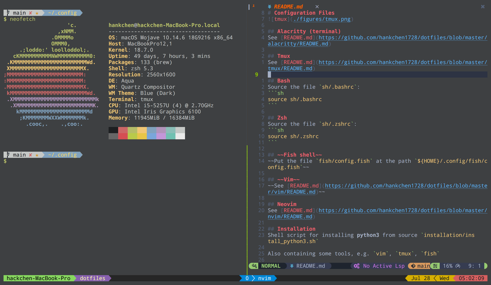

# Configuration Files


## Alacritty (terminal)
See [README.md](https://github.com/hankchen1728/dotfiles/blob/master/alacritty/README.md)

## Tmux
See [README.md](https://github.com/hankchen1728/dotfiles/blob/master/tmux/README.md)

## Bash
Source the file `bash/.bashrc`:
```sh
source bash/.bashrc
```

## Fish shell
Put the file `fish/config.fish` at the path `${HOME}/.config/fish/config.fish`

## ~~Vim~~
~~See [README.md](https://github.com/hankchen1728/dotfiles/blob/master/vim/README.md)~~

## Neovim
See [README.md](https://github.com/hankchen1728/dotfiles/blob/master/nvim/README.md)

## Installation
Shell script for installing **python3** from source `installation/install_python3.sh`

Also containing some tools, e.g. `vim`, `tmux`, `fish`

## Check NVidia GPU Environment
1. CUDA 8.0, 9.0, 9.1, 10.0
```sh
$ nvcc --version | grep "release" | awk '{print $6}'
# V10.1.243
```
2. CUDnn 6+, 7+
```sh
$ locate cudnn | grep "libcudnn.so." | tail -n1 | sed -r 's/^.*\.so\.//'
# 7.6.5
```
3. NCCL 2.0+
```sh
$ locate nccl | grep "libnccl.so" | tail -n1 | sed -r 's/^.*\.so\.//'
# 2.4.8
```

## Future Work
