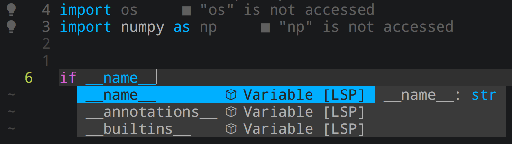

# Configuration Neovim

## Installation
1. Installing **neovim** 0.5+, downloaded from [Github release](https://github.com/neovim/neovim/releases/).
2. Installing `Packer.nvim` and required language servers
```sh
$ bash install.sh
```
3. Installing one of the patched [ Nerd-Fonts ](https://github.com/ryanoasis/nerd-fonts#patched-fonts)

## Known Issues
### LSP Start

Currently the **LSP** cannot automatically start as the nvim start, to manually start the **LSP**, it requires to call the command
`:e` or `:Lspstart` *within nvim*

## TODOs
Add more informations!
